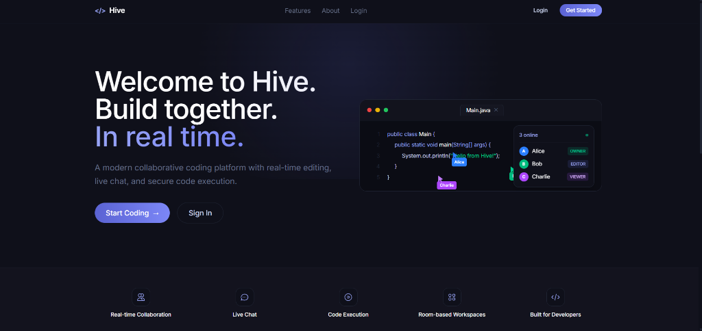
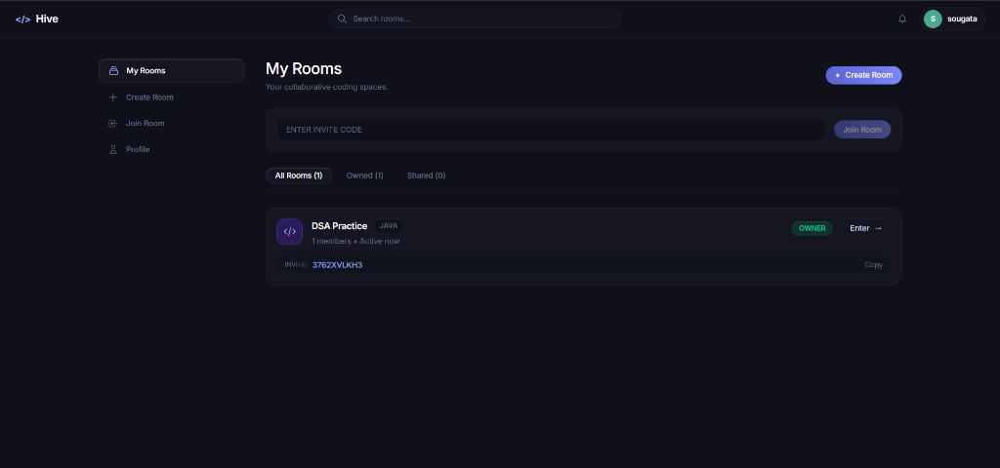

<h1 align="center">🐝 Hive — Real-Time Collaborative Coding Platform</h1>

<p align="center">
  <b>A modern, low-latency collaborative workspace where developers write, debug, and build code together in real-time.</b>
</p>

<p align="center">
  <a href="https://spring.io/projects/spring-boot"></a>
  <a href="https://www.java.com"></a>
  <a href="https://react.dev"></a>
  <a href="https://vitejs.dev"></a>
  <a href="https://tailwindcss.com"></a>
  <a href="https://microsoft.github.io/monaco-editor/"></a>
  <a href="https://yjs.dev"></a>
  <a href="https://www.mysql.com"></a>
</p>

<p align="center">
  <a href="#-overview">Overview</a> •
  <a href="#-key-features">Key Features</a> •
  <a href="#-screenshots">Screenshots</a> •
  <a href="#-system-architecture">System Architecture</a> •
  <a href="#-tech-stack">Tech Stack</a> •
  <a href="#-getting-started">Getting Started</a> •
  <a href="#-api--websocket-reference">API Reference</a> •
  <a href="#-extending-language-support">Extensibility</a>
</p>

---

## 🌟 Overview

**Hive** is a full-stack real-time collaborative development environment designed for distributed teams, pair programming, and coding interviews.

Built with a high-performance **Spring Boot 3.5** backend and a reactive **React 19 + Vite** frontend, Hive ensures conflict-free concurrent editing via **Yjs CRDTs (Conflict-free Replicated Data Types)** over WebSocket (STOMP), displays live remote cursors with user awareness, persists room conversations and versioned code snapshots in **MySQL**, and enforces strict role-based access control (**Owner**, **Editor**, **Viewer**) on every request and WebSocket frame.

---

## 📸 Screenshots

### 🚀 Landing Page




---

### 📂 Workspace Dashboard & My Rooms




---

## ✨ Key Features

| Feature | Description |
| :--- | :--- |
| **⚡ Conflict-Free Live Editing** | Powered by **Yjs CRDT** integrated with **Monaco Editor**. Multiple peers can type simultaneously on the same file with zero race conditions, merge conflicts, or overwritten characters. |
| **👥 Multi-Cursor Presence** | Real-time awareness displays remote user cursor positions, user selection highlights, and active online member indicators across tabs and sessions. |
| **💬 In-Room Live Chat** | Full-duplex WebSocket chat per room with message persistence in MySQL and paginated history retrieval. |
| **🛡️ Role-Based Access Control** | Three distinct roles: `OWNER` (full room management), `EDITOR` (edit, save, chat), and `VIEWER` (read-only observer + chat). Permissions are validated on every HTTP call and STOMP message channel. |
| **💾 Automated & Manual Snapshots** | Manual snapshots and debounced autosave back up your project into versioned `code_snapshots` rows, automatically loading the latest state on join. |
| **🔐 Production-Grade Security** | Stateless JWT authentication, BCrypt password hashing (strength 12), and database-backed SHA-256 hashed refresh tokens with automatic single-use rotation and revocation. |
| **🌐 Multi-Language Extensibility** | Designed with a strategy design pattern (`LanguageExecutor`) so new language runners and file extensions can be added without altering core architecture. |

---

## 🏗️ System Architecture

```
                                  +---------------------------------------+
                                  |            CLIENT BROWSER             |
                                  |    (React 19 + Monaco + Yjs + STOMP)  |
                                  +---------------------------------------+
                                           |                     |
                              HTTP / REST  |                     |  WebSocket (STOMP)
                             [Port: 8080]  |                     |  [/ws]
                                           v                     v
+---------------------------------------------------------------------------------------------------+
|                                      HIVE BACKEND (Spring Boot 3.5)                               |
|                                                                                                   |
|   +--------------------------+    +---------------------------+    +--------------------------+   |
|   |    Security Filter Chain |    | STOMP Inbound Interceptor |    |  Presence & Chat Handler |   |
|   |   (JWT Auth, CORS, RBAC) |    |  (Token Validation & Auth)|    |  (User tracking, Pub/Sub)|   |
|   +--------------------------+    +---------------------------+    +--------------------------+   |
|                |                               |                                |                 |
|                v                               v                                v                 |
|   +-------------------------------------------------------------------------------------------+   |
|   |                            Service Layer (Room, Chat, Code, Auth)                         |   |
|   +-------------------------------------------------------------------------------------------+   |
|                |                                                                |                 |
|                v                                                                v                 |
|   +--------------------------+                                     +--------------------------+   |
|   |  Spring Data JPA / Flyway|                                     |    LanguageExecutor      |   |
|   |   (Entities & Repos)     |                                     |  (Extensible Runner)     |   |
|   +--------------------------+                                     +--------------------------+   |
+----------------|----------------------------------------------------------------------------------+
                 |
                 v
+---------------------------------+
|         MySQL DATABASE          |
|  (Users, Rooms, Snapshots, Chat)|
+---------------------------------+
```

---

## 🛠️ Tech Stack

### Frontend
- **Framework**: React 19 (Hooks, Context API)
- **Bundler & Tooling**: Vite 6, Rolldown code-splitting
- **Editor**: Monaco Editor (`@monaco-editor/react`)
- **Real-Time Sync**: Yjs (`yjs`, `y-monaco`, `y-protocols`)
- **WebSocket Client**: `@stomp/stompjs`, `sockjs-client`
- **Styling**: Tailwind CSS v4, JetBrains Mono font

### Backend
- **Framework**: Spring Boot 3.5.16
- **Language**: Java 21+
- **Security**: Spring Security 6 (Stateless JWT, BCrypt, Token Rotation)
- **Real-Time Messaging**: Spring WebSocket (`@EnableWebSocketMessageBroker`, STOMP over SockJS)
- **Data Persistence**: Spring Data JPA / Hibernate 6
- **Database Migrations**: Flyway
- **Database**: MySQL 8.0+

---

## 🚀 Getting Started

### Prerequisites
Make sure you have the following installed on your machine:
- **Java 21+** (`java -version`)
- **Node.js 20+** & **npm** (`node -v`, `npm -v`)
- **MySQL 8.0+** running on port `3306`

---

### Step 1: Database Setup

Ensure your local MySQL service is running. Log in to MySQL and create the database and user:

```sql
CREATE DATABASE IF NOT EXISTS hive;
CREATE USER IF NOT EXISTS 'hive'@'localhost' IDENTIFIED BY 'hive_local';
GRANT ALL PRIVILEGES ON hive.* TO 'hive'@'localhost';
FLUSH PRIVILEGES;
```

> **Note**: Database schema migrations are executed automatically by Flyway upon backend startup.

---

### Step 2: Configure and Run Backend

Navigate to the `backend` directory and start the Spring Boot application:

```bash
cd backend
# On Windows:
.\mvnw.cmd spring-boot:run

# On Linux/macOS:
./mvnw spring-boot:run
```

The backend server will start on **`http://localhost:8080`**.

---

### Step 3: Configure and Run Frontend

In a new terminal window, navigate to the `frontend` directory:

```bash
cd frontend
npm install
npm run dev
```

The frontend client will be available at **`http://localhost:5173`**.

---

## 📡 API & WebSocket Reference

### REST Endpoints

#### Authentication
| Method | Endpoint | Description | Auth |
| :--- | :--- | :--- | :--- |
| `POST` | `/api/auth/register` | Register a new account (`username`, `email`, `password`) | Public |
| `POST` | `/api/auth/login` | Login with username/email and receive JWT token pair | Public |
| `POST` | `/api/auth/refresh` | Exchange refresh token for a fresh access token | Public |

#### User Profile
| Method | Endpoint | Description | Auth |
| :--- | :--- | :--- | :--- |
| `GET` | `/api/users/me` | Fetch currently authenticated user profile | Bearer JWT |
| `PUT` | `/api/users/me` | Update username, email, or avatar URL | Bearer JWT |

#### Collaborative Rooms
| Method | Endpoint | Description | Min Role |
| :--- | :--- | :--- | :--- |
| `POST` | `/api/rooms` | Create a new room (creator becomes `OWNER`) | User |
| `POST` | `/api/rooms/join` | Join an existing room via invite code | User |
| `GET` | `/api/rooms` | List all rooms user is a member of | User |
| `GET` | `/api/rooms/{id}` | Get room details | Member |
| `GET` | `/api/rooms/{id}/members` | List members and their assigned roles | Member |
| `PATCH` | `/api/rooms/{id}/members/{userId}/role` | Update user role (`OWNER`, `EDITOR`, `VIEWER`) | Owner |
| `DELETE` | `/api/rooms/{id}/members/me` | Leave room | Member |
| `DELETE` | `/api/rooms/{id}` | Delete room and revoke access | Owner |

#### Chat & Code Snapshots
| Method | Endpoint | Description | Min Role |
| :--- | :--- | :--- | :--- |
| `GET` | `/api/rooms/{id}/messages` | Get paginated chat history | Member |
| `GET` | `/api/rooms/{id}/snapshots/latest` | Retrieve latest saved snapshot | Member |
| `POST` | `/api/rooms/{id}/snapshots` | Save a new versioned snapshot | Editor |

---

### WebSocket Channels (STOMP over SockJS at `/ws`)

Authenticate by passing `Authorization: Bearer <accessToken>` in the STOMP `CONNECT` frame.

| Destination | Type | Role | Purpose |
| :--- | :--- | :--- | :--- |
| `/app/room/{id}/edit` | Publish | Editor | Broadcast Yjs binary edit delta |
| `/app/room/{id}/sync` | Publish | Member | Request / reply peer synchronization handshake |
| `/app/room/{id}/chat` | Publish | Member | Send chat message to room |
| `/app/room/{id}/presence` | Publish | Member | Publish cursor coordinate and awareness state |
| `/topic/room/{id}/code` | Subscribe | Member | Receive live CRDT document updates |
| `/topic/room/{id}/chat` | Subscribe | Member | Receive incoming real-time chat messages |
| `/topic/room/{id}/presence` | Subscribe | Member | Receive peer online status and cursor movements |

---

## 🧩 Extending Language Support

Hive is architected to make adding new programming languages simple. The execution subsystem uses a strategy pattern:

1. **Enum Definition**: Add the language constant to `ProgrammingLanguage.java` (`JAVA`, `PYTHON`, `JAVASCRIPT`, `CPP`, etc.).
2. **Strategy Implementation**: Implement the `LanguageExecutor` interface:
   ```java
   @Component
   public class PythonExecutor implements LanguageExecutor {
       @Override
       public ProgrammingLanguage language() {
           return ProgrammingLanguage.PYTHON;
       }

       @Override
       public ExecutionResult execute(String sourceCode) {
           // Compile or run in sandbox
       }
   }
   ```
3. `CodeExecutionService` automatically discovers the new bean via Spring dependency injection.
4. The frontend editor dynamically adapts file tabs (`main.py`, `index.js`, `Main.java`) and Monaco syntax highlighting.

---


